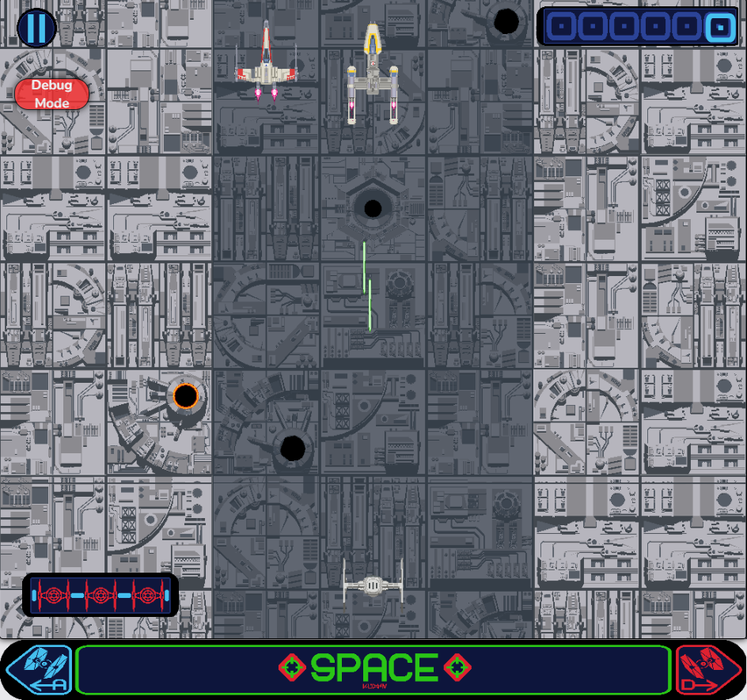

<h1 align="right">

  Death Start Raid
</h1>

<p align="right">
  Death Star Raid is a River Raid re-implementation using the Canvas API.
  <br><br>
  <!-- License -->
  <a>
    
  </a>
</p>
<br>

> Play on: https://coetus-jd.github.io/death-star-raid

## :eyes: Overview





## :open_book: About 
This game is a re-implementation of the River Raid with inspiration on Star Wars using the Canvas API.

## :bricks: This project was built with: 
- [JavaScript](https://en.wikipedia.org/wiki/JavaScript)
- [Canvas](https://developer.mozilla.org/en-US/docs/Web/API/Canvas_API)
- [Blender](https://www.blender.org/)

## 🏄‍♂️ Quick Start
 1. Clone this repository `git clone https://github.com/coetus-jd/death-star-raid.git`
 2. Enter in the project's folder: `cd death-star-raid`
 3. Finally serve the `index.html` with [Live Server extension](https://marketplace.visualstudio.com/items?itemName=ritwickdey.LiveServer) for example  😃
 
## :recycle: Contribute
 1. Fork this repository
 2. Create a branch with your feature: ```git checkout -b my-feature```
 3. Commit your changes: ```git commit -m 'feat: My new feature'```
 4. Push your branch: ```git push origin my-feature```

## :page_with_curl:	License
This project is under the GPL-3.0 license. Take a look at the [LICENSE](LICENSE) file for more details.

## 📚 Learn more
  * Canvas API: https://developer.mozilla.org/en-US/docs/Web/API/Canvas_API
